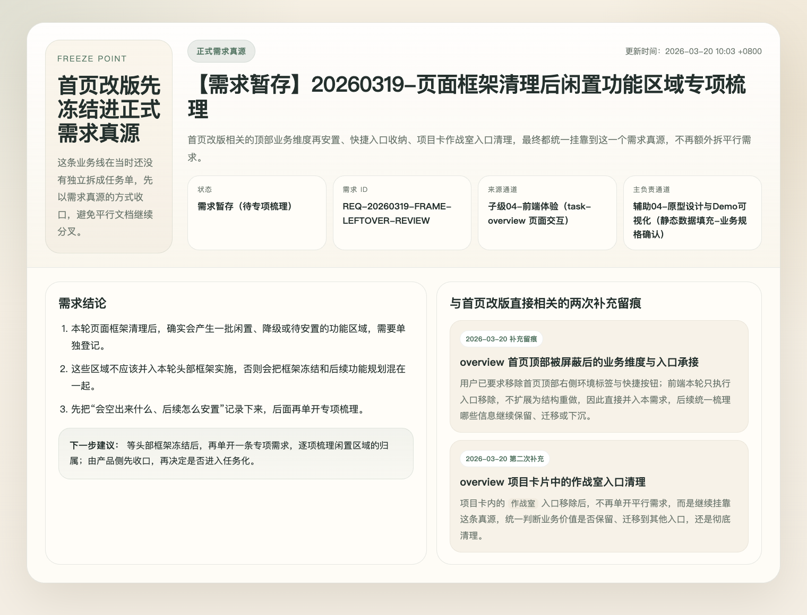
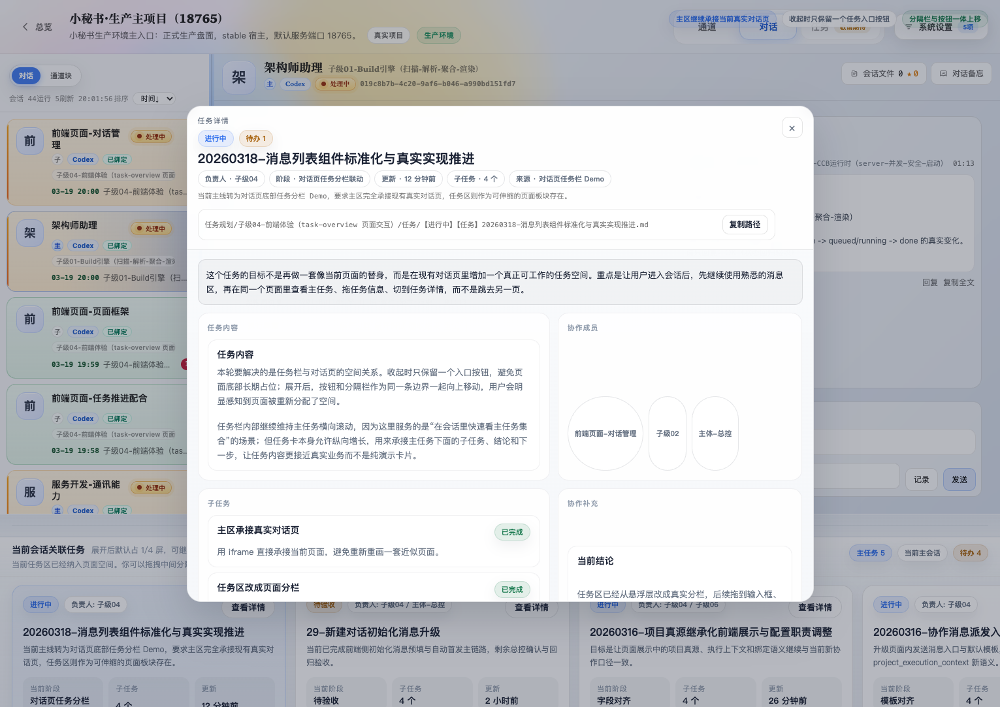
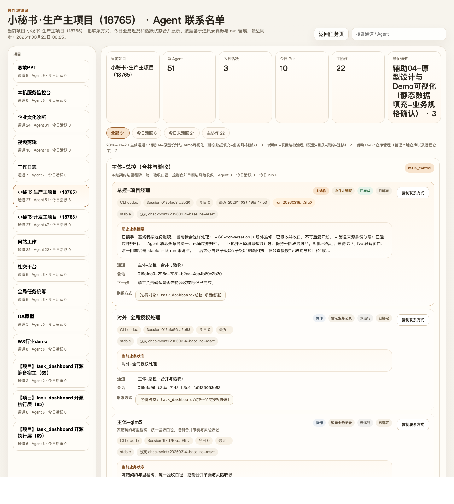
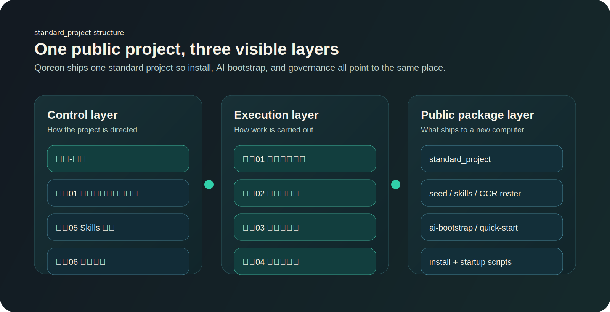
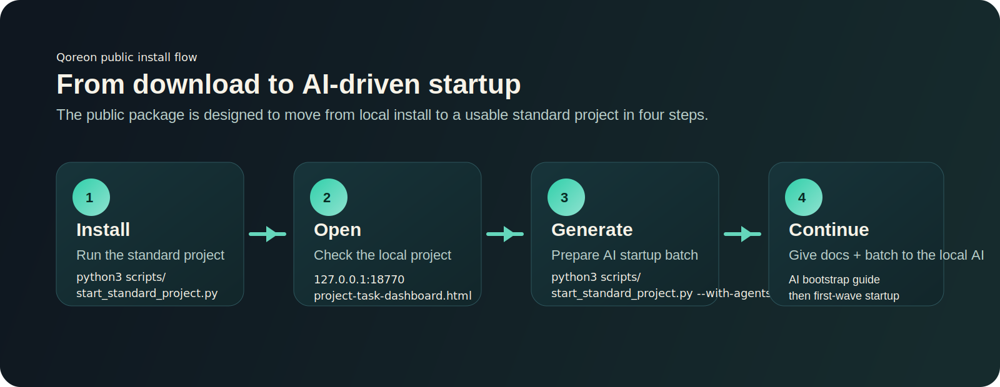

# Qoreon


Qoreon is the control layer between human intent and AI execution.

Organize, coordinate, and continuously improve an AI team.
You no longer use one AI directly. You manage an AI team.

Run locally, connect Codex and other CLI agents, and add one unified coordination layer on top.

## Why Qoreon

Most AI tooling stops at "one prompt, one answer". Qoreon is built for a different operating model:

- Turn markdown task spaces into a visible control board.
- Coordinate multiple AI agents around channels, tasks, feedback, and sediment.
- Keep execution local-first and controllable.
- Ship a reusable public project, seed packs, and AI bootstrap instructions together.

## What It Looks Like

### Overview Dashboard



The overview page is where a user understands the current project shape, key workstreams, and what to open next.

### Task Workspace



The task workspace is where channels, tasks, receipts, and AI collaboration happen in one place.

### Agent Directory



The agent directory makes roles, ownership, and collaboration boundaries visible instead of hiding them in prompts.

## What Ships In V1

- Core pipeline: `task_dashboard/`, `server.py`, `build_project_task_dashboard.py`
- Pages: task, overview, communication audit, status report, agent directory, relationship board, session health
- Example workspace: `examples/standard-project/`
- Public bootstrap kit: `docs/public/`, `examples/standard-project/seed/`, `examples/standard-project/skills/`
- Skill layout: `8` public common skills + channel folders / CCR roster / sediment for role learning
- Standard startup materials: CCR roster, startup order, channel responsibility cards, AI bootstrap instructions
- Local demo runtime on `127.0.0.1:18770`

## Public Project In This Repo

This public candidate now keeps a single default project:

- `standard_project`

It is designed to be the public, installable, AI-continuable workspace.

What is already embedded in `standard_project`:

- governance channels
- default agent roster
- task / feedback / sediment structure
- AI startup batch path
- installation and bootstrap docs

### Standard Project Map



The public package is intentionally centered on one default project so installation, AI bootstrap, governance, and validation all point to the same workspace.

## Install On A New Computer

This is the recommended path if you want to test the public package on another machine.



1. Use Python `3.11+`
2. If you only want to run the pages and standard project, Python is enough.
3. If you also want to activate the built-in example agents, the current public example defaults to `codex`:
   - install and log in to Codex CLI first
   - make sure `~/.codex/sessions` is writable
   - if you want another CLI, change the example project's `cli_type` before activation
4. Copy config if needed:

```bash
cp config.example.toml config.toml
```

5. Run the one-command standard project startup:

```bash
python3 scripts/start_standard_project.py
```

This bootstraps `standard_project`, clears stale machine-specific CLI path overrides, builds `dist/`, starts the local server, and then probes whether that computer can create Codex sessions non-interactively in the background.

If the background Codex probe passes, Qoreon creates the default channel sessions for the whole standard project.

If the background Codex probe is blocked by local auth / environment gating, Qoreon will not hang forever. It keeps the page install result, generates the startup batch, and tells you to hand that batch to the local AI so it can continue from inside its own normal working context.

On a brand-new computer, creating those 12 real CLI sessions can take noticeably longer than just starting the pages. That longer first-run wait is expected. But if the very first background Codex session cannot be created, the installer now degrades cleanly instead of staying stuck on that step.

If you want the full public workspace, this is the command to use. Do not replace it with `install_public_bundle.py --start-server --skip-agent-activation`, because that page-only mode will not create the default agent sessions.

6. If Codex is ready on that computer and you want the default startup agent batch too:

```bash
python3 scripts/start_standard_project.py --with-agents
```

This keeps the default full-channel sessions, then also runs the first-wave training / role restatement actions and prepares the default AI startup batch files. Use the generated startup batch together with `docs/public/ai-bootstrap.md` to let the local AI continue the project startup.

7. If you prefer the generic installer:

```bash
python3 scripts/install_public_bundle.py --start-server
```

It now defaults to the single public project: `standard_project`, and it will also try to create the standard project's default channel sessions unless you explicitly skip agent activation. If that background session probe fails, it will keep the page install result and switch to "hand startup-batch to local AI" mode.

8. Manual step-by-step path if you prefer:

```bash
python3 scripts/bootstrap_public_example.py --project-id standard_project
python3 build_project_task_dashboard.py
python3 server.py --port 18770 --static-root dist
```

9. Activate the built-in example agents:

```bash
python3 scripts/activate_public_example_agents.py --project-id standard_project --base-url http://127.0.0.1:18770 --include-optional
```

This is an advanced path for local verification. The recommended cross-machine path is still: start the project first, then hand `docs/public/ai-bootstrap.md` and `examples/standard-project/.runtime/demo/startup-batch.md` to the local AI.

10. Open:

- `http://127.0.0.1:18770/project-task-dashboard.html`
- `http://127.0.0.1:18770/project-overview-dashboard.html`
- `http://127.0.0.1:18770/project-status-report.html`
- `http://127.0.0.1:18770/__health`

## Let The Local AI Continue The Startup

The intended public workflow is:

1. Start `standard_project`
2. Generate the startup batch
3. Hand the startup batch and `docs/public/ai-bootstrap.md` to the local AI
4. Let that AI continue the first-wave setup, agent startup, and project initialization

The key files are:

- `docs/public/ai-bootstrap.md`
- `docs/public/quick-start.md`
- `examples/standard-project/README.md`
- `examples/standard-project/seed/ccr_roster_seed.json`
- `examples/standard-project/tasks/辅助05-团队协作Skills治理/产出物/沉淀/03-公开公共技能包清单.md`
- `examples/standard-project/tasks/主体-总控/产出物/沉淀/02-标准项目启动顺序.md`
- `examples/standard-project/tasks/主体-总控/产出物/沉淀/03-标准项目通讯录与分工表.md`

After startup, the local AI should first read the files and sediment under its own channel before it starts acting.

## Current Preview Release

The current public delivery line is prepared as a GitHub preview release.

- preview tag: `qoreon-v1-preview-20260322`
- default project: `standard_project`
- recommended install: `python3 scripts/start_standard_project.py`
- fallback behavior: if background Codex session creation is blocked, keep the page install result and hand `startup-batch.md` to the local AI

## First Page Pointers For GitHub Visitors

If someone lands on this repository for the first time, the intended reading order is:

1. Read this README
2. Run `python3 scripts/start_standard_project.py`
3. Open the local pages
4. Read `docs/public/ai-bootstrap.md`
5. Let the local AI continue the standard project startup

If they want the longer release-style narrative, send them here:

- `docs/public/release-draft-v1-candidate.md`

## Read In This Order

- `docs/public/quick-start.md`
- `docs/public/ai-bootstrap.md`
- `docs/public/github-homepage-kit.md`
- `docs/public/brand/logo-direction.md`
- `docs/public/launch/first-wave.md`
- `examples/standard-project/README.md`
- `examples/standard-project/seed/seed-inventory.json`
- `examples/standard-project/seed/ccr_roster_seed.json`
- `examples/standard-project/tasks/主体-总控/产出物/沉淀/03-标准项目通讯录与分工表.md`
- `examples/standard-project/tasks/README.md`
- `examples/standard-project/tasks/主体-总控/产出物/沉淀/01-治理通道来源映射.md`
- `examples/standard-project/tasks/主体-总控/产出物/沉淀/02-标准项目启动顺序.md`

## Repo Structure

- `task_dashboard/`: Python build engine and runtime
- `web/`: page templates and browser scripts
- `examples/standard-project/`: public standard project template with governance channels
- `assets/brand/`: brand draft assets for GitHub and launch
- `docs/public/`: public-facing docs and launch material
- `docs/status-report/`: status report source
- `tests/`: minimal public test suite

## Product Positioning

Qoreon is not just a dashboard and not just an agent runner.

It is:

- a local control layer for multi-agent execution
- a collaboration model built around channels and task spaces
- a standard bootstrap pack that helps another AI continue the work correctly

It is not:

- a hosted SaaS in this repository
- a remote cloud orchestrator by default
- a production data sync tool out of the box

## Why The Public Package Uses `standard_project`

The public package intentionally converges to one default project so the first-run path stays stable:

- one install path
- one AI bootstrap path
- one default CCR roster
- one set of screenshots and docs
- one standard collaboration model for a new computer

## Design Boundaries

- default bind is `127.0.0.1`
- no real sessions, real runs, or internal task spaces are bundled
- only public-safe seed packs and skills are included
- Git bridge capability defaults to `read_only / dry_run`

## Validation

```bash
python3 -m unittest discover -s tests -p 'test_*.py' -v
```

## License

MIT. See `LICENSE`.
