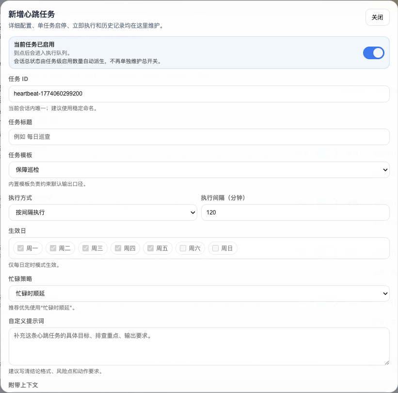

# 别把心跳当魔法：Qoreon 心跳任务自动化实战手册

适用对象：

- 已经在 Qoreon 里用 Agent 推任务，但还没有真正开始自动化的人
- 想把夜间空闲时间利用起来，让一批低风险工作自动往前走的人
- 觉得“心跳任务好像能做很多，但又经常效果一般”的人

## 1. 先说结论：心跳任务是触发器，不是全自动总控

如果只用一句话来定义当前这套能力：

**心跳任务 = 按固定时间，把一段你提前写好的提示词发给某个 Agent。**

它现在已经能做这些事：

1. 可以挂在**项目级**，也可以挂在**会话级**。
2. 可以按**固定间隔**跑，也可以按**每天某个时间点**跑。
3. 可以限制**周几执行**。
4. 可以设置目标 Agent 忙的时候怎么处理：等待空闲、直接跳过、排队执行。
5. 可以手动 `run-now` 试跑一次。
6. 每次执行都会留下运行状态和历史记录。

但它现在**还不是**这些东西：

1. 不是完整的自动编排系统。
2. 不是会自己理解上下文、自己拆解任务、自己决定全局策略的总控。
3. 不是你随便写一句“继续推进”就能稳定产出结果的夜班员工。

这件事必须讲透。因为很多时候心跳任务效果普通，不是功能没开，而是**把它当成了魔法**。

## 2. 现网真实边界：真正执行的只有 `prompt_template`

当前系统里，心跳任务虽然有 `preset_key`、`context_scope` 这些字段，但现网真正发出去的执行内容，只有你自己写的 `prompt_template`。

这意味着：

1. `preset_key` 更像分类标签，不会自动补一大段巡查说明。
2. `context_scope` 现在主要是配置层字段，不等于系统会自动把最近任务、最近 run 一股脑塞进执行消息。
3. 你晚上要让它做什么，白天就必须把动作写清楚。

所以心跳自动化的质量，核心不在“有没有启用”，而在：

**你的提示词是不是已经把任务收敛成了一段可直接执行的动作。**

### 2.1 页面里怎么配一条心跳任务

下面这两张图来自现网页面的真实操作截图。入口不藏，重点是别把“主入口摘要”和“二级配置弹框”混成一层。

主入口：先看摘要，再决定是新增、编辑还是立即执行。


二级配置：真正决定夜班效果的字段，都在这里填。



建议按这个顺序操作：

1. 在项目任务页切到 `对话`，找到目标 Agent，点右侧 `会话信息`。
2. 在弹框里滚到 `Agent 心跳任务（主入口）`，先看 `任务总数 / 已启用 / 最近执行 / 下一次` 这 4 个摘要。
3. 新建任务时点 `新增任务`；已有任务要改，就直接点该行的 `编辑`。
4. 在二级配置里优先填清这 5 个字段：`任务标题`、`任务模板`、`执行方式`、`忙碌策略`、`自定义提示词`。
5. `自定义提示词` 必须写成可直接执行的动作，不要只写“继续推进”或“你看着办”。
6. 保存后先 `立即执行` 一次，确认输出结构稳定，再交给夜间自动跑。

有三个字段要特别注意：

1. `任务 ID` 最好用稳定命名，不要长期保留随机 ID。
2. `忙碌策略` 默认优先用 `忙碌时顺延`，这样不会在 Agent 正忙时直接丢掉这轮。
3. 一次性门禁检查不要长期开启，保存后按需 `立即执行` 更稳。

## 3. 心跳任务最适合做什么

### 3.1 适合做“已经知道下一步是什么”的推进

最适合的不是开放式思考，而是这种任务：

1. 检查某类待办有没有补齐。
2. 把已经明确的下一步继续推进。
3. 到点做一次固定检查。
4. 把白天产生的零散信息汇总成一条能用的结果。
5. 把低风险的、重复性的动作在晚上批量做掉。

一句话：

**心跳任务适合“预先规划好的动作”，不适合“临场发明策略”。**

### 3.2 适合做“角色固定”的夜间值班

在多 Agent 结构里，心跳任务最像什么？

最像你给几个固定岗位排夜班：

1. 这个 Agent 负责巡查。
2. 这个 Agent 负责汇总。
3. 这个 Agent 负责补证据。
4. 这个 Agent 负责发门禁意见。

它不是让一个 Agent 半夜自己想全场该怎么打，而是让不同角色在自己已经熟悉的职责里，做一轮低风险、可预测的动作。

### 3.3 适合做“晨报前置生产”

这类能力在你们现网里其实已经出现了。

目前有一组真实的会话级心跳任务，就是典型的“夜间专题分析 -> 清晨汇总”模式：

1. `03:30` 分析工作流范式。
2. `04:00` 分析当天不满意点。
3. `04:30` 分析沟通模式。
4. `05:00` 分析审美与设计偏好。
5. `05:30` 由另一个主负责 Agent 做汇总判断。

这套玩法说明了一个很关键的事实：

**心跳任务不是只能催办，它也很适合做低风险的信息加工和知识沉淀。**

## 4. 哪些业务最值得用心跳做自动化

下面这些业务，最值得优先做。

### 4.1 待验收 / 待补证据催收

适合原因：

1. 判断标准相对清楚。
2. 输出结构固定。
3. 任务通常不是“想办法创新”，而是“把缺的补齐”。

适合让心跳去做的动作：

1. 检查哪些任务还缺验收结论。
2. 检查哪些任务缺证据路径。
3. 检查哪些任务已经可以收口但还没回传。
4. 先补能直接补的，补不了就只报唯一阻塞。

### 4.2 固定门禁检查

这是心跳任务特别适合的一类：

1. 发布前门禁检查。
2. 发布后回归检查。
3. 环境健康检查。
4. 晚间批量任务的完成度检查。

现网里已经有项目级模板：

1. `gate-release-precheck`
2. `gate-release-postsmoke`

它们现在默认关闭，这是对的。因为这类任务更适合**按事件开启、按事件手动触发**，而不是盲目定时。

### 4.3 运维巡查和异常回收

适合原因：

1. 问题类型相对集中。
2. 处理动作偏固定。
3. 夜间做一轮检查，第二天能少很多人工翻线程的成本。

适合动作：

1. 查异常会话。
2. 查残留 run。
3. 查运行态是否有明显错误。
4. 先做结论，再给处理动作。

### 4.4 已确定主线的连续推进

如果一条主线白天已经拆得很清楚，晚上完全可以让心跳继续往前推。

适合条件：

1. 目标 Agent 已经知道自己负责什么。
2. 下一步动作比较明确。
3. 不需要再请示战略判断。
4. 即使夜间推进失败，也不会造成高风险破坏。

例如：

1. 把“开发完成”继续推进到“测试 / 验收 / 收口”。
2. 把“已整理好的需求”继续转成原型或任务草案。
3. 把“已明确的专项升级点”继续推进到补稿、补图、补索引。

### 4.5 夜间专题总结和知识沉淀

这类工作其实很适合放到凌晨：

1. 汇总当天聊天里的方法论。
2. 提炼用户表达偏好。
3. 总结某个通道近期的稳定工作法。
4. 把多条消息压缩成一份次日可读的沉淀。

它的优势是：

1. 不打扰白天推进节奏。
2. 风险低。
3. 非常适合多 Agent 分工协作。

## 5. 哪些事情不要交给心跳任务

这部分比“能做什么”更重要。

### 5.1 不要让它替你做战略决策

例如：

1. 这条产品路线到底要不要转向。
2. 这次架构应该选哪条路线。
3. 这个高风险改动要不要上生产。

这些事情要的是拍板，不是定时触发。

### 5.2 不要让它处理开放式、模糊式要求

比如：

- “你看看还有什么可以做的。”
- “请继续推进整个项目。”
- “你自由发挥，想办法把问题解决掉。”

这类提示词在白天都未必稳定，到了夜里更容易跑偏。

### 5.3 不要让它执行高破坏性动作

例如：

1. 自动发布。
2. 自动回滚。
3. 自动批量改配置。
4. 自动删文件。
5. 自动合并高风险改动。

心跳可以做检查和判断，但不要默认给它执行破坏性动作的权限。

### 5.4 不要把跨多人、多回合协调问题全压给一个心跳

如果一个动作需要：

1. 等多个 Agent 回答。
2. 汇总结果。
3. 再决定下一轮触发谁。

那它就已经不只是“一个心跳任务”了，而更像一套编排机制。这个时候应该考虑：

1. 心跳只做第一层触发。
2. 结果交给回执包 / Reviewer / 总控去汇总。

## 6. 三种最实用的心跳玩法

### 6.1 玩法一：持续推进型

目标：让一个已明确职责的 Agent 不停在说明态。

适合：

1. 开发主线推进。
2. 测试与验收收口。
3. 某类专项长期补齐。

推荐配置：

1. `schedule_type=interval`
2. 周期不要太短，通常 `40` 到 `120` 分钟更稳。
3. `busy_policy=run_on_next_idle`

为什么：

- 这类任务要的是“忙完继续做”，不是“忙了就算了”。

### 6.2 玩法二：门禁检查型

目标：在关键节点做一次严格检查，而不是持续推进。

适合：

1. 发布前检查。
2. 发布后回归。
3. 上线窗口前的最终确认。

推荐配置：

1. 项目级任务。
2. 默认 `enabled=false`。
3. 真到节点时手动 `run-now`。
4. `busy_policy=skip_if_busy`。

为什么：

- 这类检查讲究“时点正确”，如果错过时点，旧结果就不值钱了。

### 6.3 玩法三：夜班汇总型

目标：夜里先做一轮专题分析，早上给主负责 Agent 一条更能用的结论。

适合：

1. 日志总结。
2. 用户偏好提炼。
3. 协作模式沉淀。
4. 某个专题的一日一收束。

推荐配置：

1. `schedule_type=daily`
2. 按时间错峰排开多个 Agent。
3. 最后留一个总汇总 Agent。
4. `busy_policy=run_on_next_idle`。

为什么：

- 这类任务最怕互相抢资源；错峰执行，会比同时开跑稳很多。

## 7. 忙时策略怎么选

这是很多人会忽略，但实际非常影响效果的一个配置。

### 7.1 `run_on_next_idle`

含义：如果目标 Agent 正忙，就等它空下来再跑。

适合：

1. 主线推进。
2. 日报 / 汇总。
3. 需要“迟一点也要做”的任务。

不适合：

1. 对时点非常敏感的门禁检查。

### 7.2 `skip_if_busy`

含义：如果目标 Agent 正忙，这一轮直接跳过。

适合：

1. 发布前门禁。
2. 发布后回归。
3. 一次性事件检查。
4. 过期就不值钱的检查任务。

### 7.3 `queue_if_busy`

含义：如果目标 Agent 正忙，就先进队列，稍后再发。

适合：

1. 必须执行，但又不是立即执行的任务。
2. 低风险、轻量级、可排队的一次性批处理。

使用提醒：

- 不要给高频任务随便配 `queue_if_busy`，不然很容易把队列越积越长。

## 8. 晚间自动化推进，建议怎么做

这部分最值得直接照着用。

### 8.1 白天先做准备，不要晚上临时想

夜班自动化能不能有效，主要取决于白天准备得够不够清楚。

至少要提前写清楚这 6 件事：

1. 这轮夜班想推进什么。
2. 哪些任务属于低风险、可自动继续。
3. 每个任务应该交给哪个 Agent。
4. 每个 Agent 这轮只允许做什么，不允许做什么。
5. 输出格式是什么。
6. 什么情况算完成，什么情况只回唯一阻塞。

如果这 6 条白天没写清楚，晚上大概率只是“又跑了一轮说明文字”。

### 8.2 推荐一组夜班分工

你们现在的系统，很适合把夜班拆成四类 Agent：

1. `推进 Agent`
   - 负责把已经明确的任务继续向前推一步。
   - 例如：补证据、补文档、补回执、补专题沉淀。

2. `巡查 Agent`
   - 负责查异常、查阻塞、查未收口项。
   - 例如：运行态异常、待验收堆积、长时间无回执任务。

3. `门禁 Agent`
   - 负责在特定节点给放行 / 不放行意见。
   - 例如：发布前检查、发布后回归。

4. `汇总 Agent`
   - 负责把前面几类结果收成一条次日可消费的结论。
   - 例如：晨间总结、升级建议、唯一风险列表。

这样做的好处是：

- 每个 Agent 夜里只干自己那类事，不会一锅煮。

### 8.3 一组可直接参考的夜班批次

#### 批次 A：低风险收口批

适合放到夜里做：

1. 待验收项补证据。
2. 任务文件补结论。
3. 缺路径、缺 `run_id`、缺下一步动作的项做整理。
4. 可直接归档的沉淀文档整理。

#### 批次 B：巡查批

适合放到夜里做：

1. 会话异常巡查。
2. run 残留巡查。
3. 活跃主线停滞项排查。
4. 待验收积压排查。

#### 批次 C：知识加工批

适合放到夜里做：

1. 当日总结。
2. 协作模式分析。
3. 用户偏好提炼。
4. 某个专题的总结稿。

#### 批次 D：事件门禁批

只在特殊节点用：

1. 发布前检查。
2. 发布后检查。
3. 夜间专项切换后的回归确认。

### 8.4 夜班提示词怎么写才像真自动化

不要写：

- “继续推进。”
- “你看看还有什么要做的。”
- “围绕这个问题做自动化。”

要写成这种结构：

1. 目标：这一轮只处理什么。
2. 动作：按什么顺序做。
3. 边界：不要做什么。
4. 输出：只输出什么字段。
5. 升级条件：什么情况停止自动化并报阻塞。

一个够用的夜班模板可以写成：

```text
请只处理以下范围：<范围>

本轮目标：<一句话目标>
执行动作：
1. <动作1>
2. <动作2>
3. <动作3>

不要做：
1. <禁止项1>
2. <禁止项2>

输出格式只保留：
- 当前结论
- 是否通过或放行
- 唯一阻塞（无则写无）
- 关键路径或 run_id
- 下一步动作

如果发现需要人工拍板、存在高风险操作、或依赖外部确认，请停止继续自动推进，只回唯一阻塞。
```

## 9. 一个很实用的判断公式

如果你不确定一个业务该不该上心跳，直接用这 4 个问题判断：

1. 这件事是不是已经知道下一步怎么做？
2. 这件事就算夜里失败，风险是不是可控？
3. 这件事的输出能不能收敛成固定结构？
4. 这件事是不是值得用定时触发来替代人工提醒？

如果 4 条里满足 3 条以上，就很适合做。

如果 4 条里只满足 1 条，最好不要上。

## 10. 我对你们当前系统的建议

结合现网能力，我建议你们把心跳任务定位成三层用途：

### 第一层：日常低风险自动化

优先做：

1. 待验收补齐。
2. 运维巡查。
3. 文档 / 知识沉淀。
4. 固定门禁检查模板。

### 第二层：夜班批处理

优先做：

1. 一组已经写清楚动作的专项任务。
2. 多 Agent 错峰执行。
3. 早上由一个主负责 Agent 做汇总。

### 第三层：未来自动化的触发层

这层不是现在就要全做，而是一个方向：

1. 心跳继续做“定时触发”。
2. 未来再补“状态机 + 回执包 + Reviewer + 升级策略”。
3. 把自动化从“定时发一段话”升级成“有判断、有验证、有收口的闭环”。

## 11. 一句话结论

**心跳任务最适合拿来做“预先写清楚、低风险、可结构化输出”的自动推进和夜班批处理。**

不要把它当魔法，也不要把它当总控。把它当成一套给固定 Agent 排班的触发器，你们会更容易把自动化真正跑起来。
